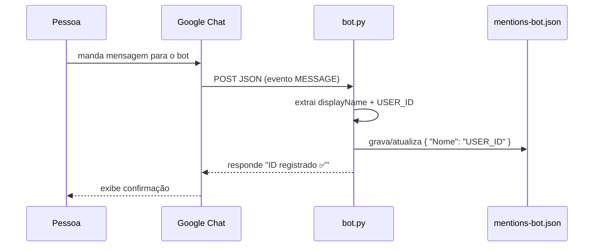

# Bot de captura de USER_IDs — `tools/bot.py`

Bot do Google Chat que **captura automaticamente o `USER_ID`** de quem manda
mensagem para ele e grava no arquivo `mentions-bot.json`, no formato consumido
pelo `main.py` para gerar menções reais (`<users/USER_ID>`) no alerta de plantão.

É a alternativa mais simples ao `tools/build_mentions.py`: em vez de depender de
domain-wide delegation e da Admin SDK, **cada pessoa só precisa mandar uma
mensagem para o bot** e o ID dela é registrado.

---

## 1. Como funciona



Quando alguém envia uma mensagem (DM) ou adiciona o bot a um espaço, o Google
Chat faz um `POST` para a URL configurada. O corpo do evento traz o remetente:

```json
{
  "type": "MESSAGE",
  "message": {
    "sender": {
      "name": "users/123456789012345678901",
      "displayName": "Fulano de Tal",
      "type": "HUMAN"
    }
  }
}
```

O bot extrai `displayName` e o `USER_ID` (parte depois de `users/`) e atualiza o
arquivo:

```json
{
  "Fulano de Tal": "123456789012345678901"
}
```

A escrita é **atômica** (`os.replace`) e protegida por _lock_, suportando vários
envios simultâneos sem corromper o arquivo.

---

## 2. Pré-requisitos

- Python 3.10+ (funciona em 3.9, mas é recomendado atualizar).
- Dependências do projeto instaladas:
  ```bash
  pip install -r requirements.txt
  ```
  O `requirements.txt` já inclui `flask`, `google-auth` e `python-dotenv`.
- Acesso de **administrador do Google Workspace** (ou alguém com permissão) para
  configurar o app na Google Chat API.
- Um projeto no **Google Cloud** com a **Google Chat API** habilitada.

---

## 3. Configuração via `.env`

O bot carrega o arquivo `.env` automaticamente (via `python-dotenv`). Variáveis
relevantes:

| Variável              | Obrigatória | Padrão              | Descrição                                                                 |
| --------------------- | :---------: | ------------------- | ------------------------------------------------------------------------- |
| `MENTIONS_BOT_PATH`   |     Não     | `mentions-bot.json` | Caminho do arquivo onde os IDs capturados são gravados.                   |
| `CHAT_PROJECT_NUMBER` |  Recomend.  | _(vazio)_           | Número do projeto no Google Cloud. Ativa a validação do token JWT.        |
| `CHAT_AUDIENCE`       |     Não     | _(vazio)_           | Alternativa ao `CHAT_PROJECT_NUMBER` (use um ou outro).                    |
| `PORT`                |     Não     | `8080`              | Porta em que o servidor HTTP sobe.                                         |

Exemplo de `.env`:

```dotenv
MENTIONS_BOT_PATH=./mentions-bot.json
CHAT_PROJECT_NUMBER=000000000000
PORT=8080
```

> Variáveis exportadas no ambiente têm prioridade sobre o `.env`.

### Segurança (validação do token)

O Google Chat assina cada requisição com um JWT no header
`Authorization: Bearer <token>`, emitido por `chat@system.gserviceaccount.com`.

- Se `CHAT_PROJECT_NUMBER` (ou `CHAT_AUDIENCE`) **estiver definido**, o bot
  valida emissor e audiência e rejeita requisições inválidas com `401`.
- Se **não estiver definido**, a validação é desativada (útil só para testes
  locais). **Em produção, sempre defina** `CHAT_PROJECT_NUMBER`.

---

## 4. Rodando o bot

```bash
# dentro do venv, com o .env configurado
python tools/bot.py
```

Saída esperada:

```
... [INFO] chat-bot: Bot ouvindo em 0.0.0.0:8080 — gravando em ./mentions-bot.json
```

Endpoints expostos:

| Método | Rota      | Descrição                                            |
| ------ | --------- | ---------------------------------------------------- |
| `GET`  | `/health` | Health check (`{"status":"ok"}`).                    |
| `POST` | `/`       | Recebe os eventos do Google Chat.                    |

---

## 5. Expondo o bot na internet

O Google Chat precisa alcançar seu endpoint por **HTTPS público**. Escolha uma
das opções:

### Opção A — Teste rápido com ngrok

```bash
ngrok http 8080
# copie a URL gerada, ex.: https://ab12cd34.ngrok-free.app
```

A URL do endpoint a usar no Console será a raiz: `https://ab12cd34.ngrok-free.app/`

### Opção B — Produção com Google Cloud Run (recomendado)

```bash
gcloud run deploy alerta-plantao-bot \
  --source . \
  --region us-central1 \
  --allow-unauthenticated \
  --set-env-vars MENTIONS_BOT_PATH=/tmp/mentions-bot.json,CHAT_PROJECT_NUMBER=000000000000
```

> ⚠️ No Cloud Run o sistema de arquivos é efêmero. Para persistir o
> `mentions-bot.json` entre execuções, monte um volume (GCS FUSE) ou grave em um
> bucket/Firestore. Para uso pontual (coletar IDs uma vez), `/tmp` é suficiente:
> baixe o arquivo logo após a coleta.

Ao final, o Cloud Run devolve uma URL `https://alerta-plantao-bot-xxxx.run.app`.

---

## 6. Conectando ao Google Chat (Console)

1. Acesse <https://console.cloud.google.com/> e selecione seu projeto.
2. **Habilite a API**: _APIs & Services → Library_ → busque **Google Chat API** →
   **Enable**.
3. Vá em **Google Chat API → Configuration**.
4. Preencha a identidade do app:
   - **App name**: `Alerta Plantão Bot`
   - **Avatar URL**: URL de um ícone (ex.: um PNG público)
   - **Description**: `Captura o USER_ID para o alerta de plantão`
5. Em **Interactivity / Functionality**, marque:
   - ✅ **Receive 1:1 messages** (mensagens diretas)
   - ✅ **Join spaces and group conversations** (opcional, para espaços)
6. Em **Connection settings**:
   - Selecione **HTTP endpoint URL**.
   - Cole a URL pública **com a barra final**, ex.:
     `https://alerta-plantao-bot-xxxx.run.app/`
7. Em **Visibility**, escolha quem pode usar o bot:
   - Pessoas/grupos específicos, **ou**
   - Todo o domínio do Workspace.
8. Clique em **Save**.
9. Pegue o **Project number** em _IAM & Admin → Settings_ (ou no topo do
   dashboard) e coloque no `.env` como `CHAT_PROJECT_NUMBER`. Reinicie o bot.

---

## 7. Como as pessoas usam

1. No Google Chat, a pessoa clica em **New chat / Find apps** e procura por
   **Alerta Plantão Bot**.
2. Abre uma conversa direta e manda **qualquer mensagem** (ex.: `oi`).
3. O bot responde confirmando e grava o ID:

   > Pronto, **Fulano de Tal**! Seu USER_ID foi registrado ✅
   > `123456789012345678901`
   > Já pode ser mencionado no alerta de plantão.

Cada pessoa que fizer isso vira uma entrada no `mentions-bot.json`.

---

## 8. Usando o arquivo gerado no alerta

Depois de coletar os IDs, aponte o `main.py` para o arquivo do bot:

```dotenv
# no .env
MENTIONS_PATH=./mentions-bot.json
```

```bash
python3.9 main.py --dry-run   # confira o preview com as menções
python3.9 main.py             # envia para o Google Chat
```

Comportamento do `main.py` (já implementado):
- Nome **com** ID no arquivo → vira menção real `<users/ID>`.
- Nome **sem** ID no arquivo → aparece o nome em texto puro (sem menção) e loga
  um aviso uma vez.

> Você pode manter dois arquivos (`mentions.json` e `mentions-bot.json`) e
> escolher qual usar via `MENTIONS_PATH`, ou mesclar manualmente os dois.

---

## 9. Solução de problemas

| Sintoma                                            | Causa provável / solução                                                                 |
| -------------------------------------------------- | ---------------------------------------------------------------------------------------- |
| Bot não responde no chat                           | URL no Console errada (use a raiz `/` com HTTPS) ou servidor fora do ar. Veja `/health`. |
| Respostas retornam `401 unauthorized`              | `CHAT_PROJECT_NUMBER` diferente do número real do projeto. Ajuste no `.env`.             |
| `mentions-bot.json` não é criado                   | Permissão de escrita no diretório / `MENTIONS_BOT_PATH` inválido. Verifique os logs.     |
| Arquivo some no Cloud Run                          | FS efêmero. Use volume/bucket ou baixe o arquivo após a coleta.                          |
| `ModuleNotFoundError: flask`                       | Rode `pip install -r requirements.txt`.                                                  |
| ID não capturado / “não consegui identificar”      | Mensagem veio sem `sender.name` no formato `users/...` (ex.: outro bot). Ignorado.       |

---

## 10. Resumo rápido

```bash
# 1. configurar
echo "MENTIONS_BOT_PATH=./mentions-bot.json" >> .env
echo "CHAT_PROJECT_NUMBER=000000000000"      >> .env

# 2. rodar + expor
pip install -r requirements.txt
python tools/bot.py
ngrok http 8080            # ou deploy no Cloud Run

# 3. Console → Google Chat API → Configuration → HTTP endpoint = URL pública

# 4. pessoas mandam mensagem para o bot

# 5. usar no alerta
export MENTIONS_PATH=./mentions-bot.json
python3.9 main.py
```
